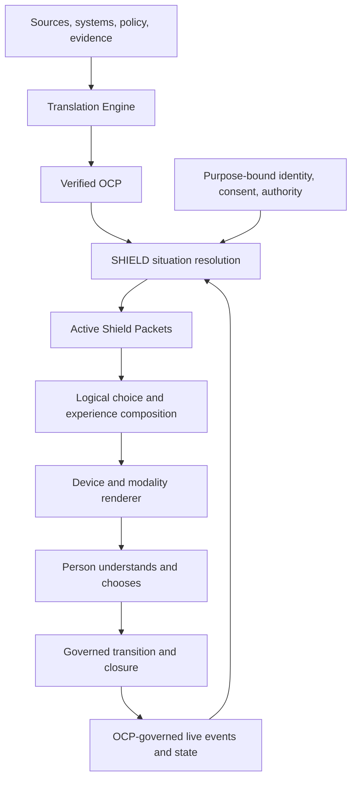

<!--
Provenance
  Original title: SHIELD Research Monograph Series -- Volume II:
  Evolution Recovery and OCP-Driven Logical Composition Model, v0.2
  Type: Markdown -- the FROZEN, approved source this corpus's addendum
  (shield-volume-ii-approval-incorporation-addendum-v0.2.1.md)
  incorporates approval into.
  SHA-256: bc6afa76fb05fe8d843020e725b4b6e729e73529a6bf4672c5de260c7a57b912
  (verified to match the addendum's recorded hash exactly)
  Approval ID: CANON-APR-20260717T162332-QZZI8I (see the companion
  approved-shield-volume-ii-evolution-recovery-v0.2-working-architecture.json
  in this directory for the full approval record)
  Recovered from ~/Downloads: 2026-09-07, by stacey@solidstride.ca
  Status: approved_working_architecture / prototype baseline -- NOT
  constitutional canon. Per the addendum, only Decisions 1-6 and 8-10
  are frozen/approved; Decision 7 (identity) is quarantined. This file
  itself is FROZEN -- do not edit in place; any revision is a new
  versioned work product per the addendum's own rule.
-->

# SHIELD Research Monograph Series — Volume II

## Evolution Recovery and OCP-Driven Logical Composition Model

**Canonical name:** SHIELD: Semantic Human Intelligence & Execution Layer Domain  
**Subtitle:** Universal Experience Composition & Rendering Architecture  
**Document type:** Canon-recovery synthesis and decision-ready working architecture  
**Truth classification:** Recovered doctrine, controlled historical lineage, candidate architecture, and explicit open questions  
**Canon status:** Working model for approval; not yet constitutional canon  
**Version:** 0.2  
**Date:** July 17, 2026  
**Governing direction:** Most recent explicit direction controls earlier manuscripts, prototypes, diagrams, and formal claims  
**Governing baseline:** SHIELD Volume II Canon Control and Re-entry Package v0.1, as corrected by the controlling direction recorded in this document  

> **Controlling correction.** SHIELD is not a tap menu and is not constitutionally defined by a four-quadrant, Dial, Pearl, Pad, Ring, Pack, Path, or Stack interface grammar. A Shield carries and resolves governed data packets, then presents their meaning, evidence, choices, and consequences in the most logical order for the person and situation. The OCP supplies the governed operational meaning and data contract. SHIELD supplies runtime resolution, logical composition, rendering, interaction, transition, and closure. Packs and Stacks remain important candidate structures for LumaShield, including identity and distribution, but they are not the only way an OCP may be used and are not prerequisites for every SHIELD rendering.

---

# 1. Executive Determination

The historical record does not describe one finished architecture that merely needs polishing. It describes a sequence of increasingly capable attempts to express one durable idea:

> **People should not have to learn software. Verified operational reality should compose itself into a calm, immediately understandable experience that helps a person understand, choose, act, and remain in control.**

The strongest current representation is therefore not a fixed screen anatomy. It is an end-to-end constitutional architecture:

1. The **Translation Engine** translates source material, systems, evidence, policy, and operational knowledge into a verified Operational Context Package.
2. The **OCP** is the authoritative, versioned, provenance-bearing contract of operational meaning available to SHIELD. Live data may arrive later, but only through sources, event types, identities, constraints, and connector contracts governed by that OCP.
3. **SHIELD** resolves the OCP against the person, purpose-bound identity, authority, intent, live state, evidence, device, accessibility needs, and prior continuity.
4. SHIELD produces or activates bounded **Shield Packets** carrying the information and coordination state required for the present situation.
5. **SHIELD Logic** determines what must be understood, what choices are valid, which choices must precede others, what evidence and consequences must be visible, and which actions must remain available.
6. The **experience composer and renderer** translate that resolved packet state into the most suitable visual, spatial, conversational, auditory, tactile, camera, sensor, or mixed-mode experience.
7. The person acts, declines, pauses, explores, delegates, escalates, or requests more evidence. SHIELD records the governed transition and closure without silently changing intent, authority, or meaning.

This architecture preserves the practical achievement of the STCOS prototype generators while removing the structural overreach that accumulated around particular prototype geometries.

## 1.1 The constitutional definition recovered by this review

> **A Shield is the governed human-facing coordination environment produced by resolving verified OCP meaning with a person’s purpose-bound identity, authority, intent, live context, evidence, capabilities, and continuity, then composing bounded data packets into a calm, logically ordered, device-appropriate experience that preserves human understanding, choice, and control.**

**Status:** Candidate constitutional definition with strong recovered support.

## 1.2 What “universal translation” means without collapsing the two pillars

The system-level promise may correctly be described as universal translation into rendered experience:

> **Anything that can be responsibly understood as governed operational meaning should be translatable into a human experience.**

The architectural responsibility remains divided:

- Volume I and the Translation Engine translate sources into verified operational meaning.
- The OCP carries that verified meaning across the constitutional boundary.
- Volume II and SHIELD resolve, compose, render, and govern the human experience.

The Translation Engine does not become the interface engine, and SHIELD does not rediscover or rewrite organizational truth.

---

# 2. Source Authority and Review Method

## 2.1 Controlling source order

| Priority | Source class | Controlling use |
|---:|---|---|
| 1 | Stacey Malitowski’s most recent explicit direction, July 17, 2026 | Corrects all earlier assumptions: OCP supplies SHIELD; Pack/Stack is theoretical and non-exclusive; identity must fit within Shields and Stacks; Packets are essential; rendered option order must be perfectly logical. |
| 2 | `University of Lethbridge R&D - Mathematical Approach to Coordination.md` — full exported working session | Primary evolution record for the movement from mathematical coordination theory, through prototype generation, toward Translation Engine → OCP → SHIELD architecture. |
| 3 | STCOS prototype-generator conversations and doctrine exports | Primary practical evidence of what produced successful cross-domain Shield prototypes and where interface formalization became too rigid. |
| 4 | Approved Volume II canon-control package and July 17 architecture review | Controls publication boundaries, two-pillar separation, terminology retirement, and research-claim discipline. |
| 5 | LumaShield/LifeShield protocol, identity, trust, packet, invention, and early visual artifacts | Constitutional and product lineage. Recovered only where compatible with priorities 1–4. |
| 6 | Computability and mathematical-architecture manuscripts | Research prompts only. Formal claims require proof and validation before canonization. |

## 2.2 Primary referenced files

| Ref. | Source | Treatment in this document |
|---|---|---|
| **S1** | `University of Lethbridge R&D - Mathematical Approach to Coordination.md` (`file_000000003e8471fd87861fabe67d89cf`) | Referenced as an entire-session evolution record. Decision-bearing passages were traced across the full export, including early fixed grammar, the STCOS prototype phase, OCP development, the two-pillar correction, and the July 17 canon review. |
| **S2** | `SHIELD_Architecture_and_Publication_Review_2026-07-17.md` (`file_000000003d6871fd9e1deb0a14aedeb6`) | Publication and architecture control. |
| **S3** | `Pasted markdown.md` (`file_0000000066c071fd8c37d69df81f172d`) | Supplemental exported discussion. |
| **S4** | `LUMA SHIELD CANONICAL BIBLE.pdf` (`file_00000000747471fdb2799fa037347a0d`) | Version 1.59 doctrine lineage; not current total architecture. |
| **S5** | `LUMAShield - LUMA ID Institutional Trust & Public Legitimacy Framework__(1).pdf` (`file_00000000afd8723091255475ce1f9408`) | Identity, legitimacy, accountability, and anti-surveillance lineage. |
| **S6** | `LUMAShield - LUMA ID Security, Privacy & Trust Architecture Memo(1).pdf` (`file_000000001e7071f5baeee85b363114c5`) | Purpose limitation, minimization, contextual trust, and sovereign identity lineage. |
| **S7** | `SHIELD Architecture Series Volume II — Part II.pdf` (`file_000000007e3071f8961001064bab052c`) | Earlier composition and runtime separation; fixed interface grammar retired. |
| **S8** | `Shield Packet Architecture .pdf` (`file_00000000b49c71f893ba6f11c02d125a`) | Packet-carrier and coordination-flow lineage. |
| **S9** | `SHIELD-Architecture-Series-Volume-II-Part-I.pdf` (`file_00000000c3e871fd8453195fb7dc8349`) | Earlier OCP handoff and runtime-contract lineage. |
| **S10** | `SHIELD-Architecture-Series-Volume-III(1).pdf` (`file_0000000024a871fdb0af846a891f693d`) | Historical interaction doctrine; calm, context-first, reversible principles recovered. |
| **S11** | `SHIELD-Architecture-Series-Volume-IV(1).pdf` (`file_00000000219c71fda6c0f7d6435fb95b`) | Engineering, provenance, versioning, connector, and runtime-specification lineage. |
| **S12** | `SHIELD-Architecture-Update-001.pdf` (`file_00000000faf071fd912d756b41f241c0`) and `SHIELD-Architecture-Update-002.pdf` (`file_00000000a29c71fdbf1f9f787edf5129`) | Product and ecosystem relationship history. |
| **S13** | `Stacey OS - Doctrine Update Assessment.md` (`file_00000000399c71f8aab088ac16ba637f`) | Doctrine-evolution record that predates the current two-pillar reconciliation. |
| **S14** | `Luma Shield Canonical System Invention Dossier.md` (`file_00000000087071fd827245700cd772cc`) | Patent-era Packet, synchronization, permission, identity, lifecycle, and stacking lineage. |
| **S15** | `Computability of Coordination_ Shield Architecture.pdf` (`file_000000008aa471f5854d911b797e312d`) | Mathematical research agenda; not proof of universal computability. |

## 2.3 STCOS prototype-generation corpus

The following STCOS project conversations are explicitly incorporated as practical architecture evidence:

- `Stacey OS - SHIELD Prototype Generation Engine.md`
- `Stacey OS - Branch · SHIELD Prototype Generation Engine.md`
- `Stacey OS - SHIELD Prototype Engine Integration.md`
- `Stacey OS - SHIELD Prototype Doctrine Export.md`
- `Stacey OS - Pipeline Refinement Discussion.md`
- `Stacey OS - OCP Translation Architecture.md`
- `Stacey OS - SHIELD Prototype Generator Builder.md`
- `Stacey OS - Shield Prototype Generator Retired.md`

The attached STCOS visual references were reviewed as design-lineage evidence. They preserve Luma presence, calm visual identity, semantic color, and coherent frame language. They do not establish a mandatory runtime layout.

## 2.4 Truth labels

| Label | Meaning |
|---|---|
| **Controlling** | Most recent explicit direction. Overrides conflicting earlier content. |
| **Recovered** | Repeatedly and directly supported across the record. |
| **Candidate** | Best current reconciliation, requiring explicit approval before becoming canon. |
| **Historical** | Valuable lineage or prototype evidence, not current doctrine. |
| **Research** | A proposition to test, not an architectural fact. |
| **Retired** | Must not be presented as current architecture. |

---

# 3. Evolution Recovered Backwards from Today

Working backwards prevents an early attractive prototype from being mistaken for the final system.

| Period | What the work had reached | What survives | What does not control today |
|---|---|---|---|
| **July 17, 2026 — controlling correction** | OCP must provide SHIELD’s governed data; SHIELD carries packets and renders them into a perfectly logical experience; Pack/Stack is a theoretical and LumaShield-important model, not the only OCP use; identity belongs within Shields and Stacks. | OCP-driven rendering, packet carriage, logical option order, identity projection, Packs essential to future LumaShield, non-exclusive rendering grammar. | Treating Pack/Packet/Path/Stack as four settled universal constitutional primitives. |
| **July 2026 — Volume II reconciliation** | Translation Engine and SHIELD recognized as peer constitutional pillars connected by the OCP; SHIELD Studio retained; fixed Dial/Pearl/Pads/Ring grammar retired. | Translation → OCP → SHIELD; universal experience composition; source/runtime boundary; governed publication. | Old component names, old volume ownership, fixed interface anatomy. |
| **Late June–July 2026 — STCOS prototype engines** | Deep-research organizational material could be transformed into OCP-like operational context and rendered into compelling, highly specific cross-domain Shield prototypes with little extra prompting. | OCP semantic richness, brand/cultural context, context-specific composition, live composer, stable-within-context frame, multimodal possibilities, state transitions rather than screen navigation. | A frozen dashboard template; Google AI Studio or any one renderer as source of truth; prototype screenshots as constitutional layouts. |
| **June 2026 — OCP and Studio pipeline** | OCP sections, provenance, connector knowledge, runtime contracts, validation, and prototype publication were separated. | OCP as governed semantic and operational contract; Studio as authoring, testing, validation, and publishing environment. | Embedding mandatory pixel coordinates or one UI grammar inside the OCP. |
| **May–June 2026 — mathematical coordination models** | Intent, Authority, Dependency, Resolution, Cells, Stacks, Packs, graphs, search, and state-transition theories were explored. | Formalization agenda; dependency analysis; constraints; deadlock, escalation, state, resolution, and closure questions. | Claims that coordination is fully or exactly computable; fixed 4×4×4 structures; authority rewriting intent; deterministic elimination of human ambiguity. |
| **March 18–21, 2026 — Pack, Packet, and Stack expansion** | Packets became portable coordination objects; Packs were imagined across social and institutional domains; standardized and programmable Packs coexisted; identity Packs emerged. | Portable bounded packets; reusable governed packages; shared state; consent; blank and standardized LumaShield extensions; person-controlled adoption. | Fixed cardinalities, universal Pack hierarchy, or a product library becoming the universal OCP model. |
| **March 14–17, 2026 — interaction grammar** | Four quadrants, center core, Dial, Pearl, Pads, Ring, gestures, one-glance, and one-tap interaction were developed into a recognizable anatomy. | One-glance comprehension; one-tap success; spatial continuity; calm adaptation; context changes rather than navigation burden; human choice. | The exact anatomy, four-option limit, component names, and gesture map as universal law. |
| **March 5–6, 2026 — earliest verified conceptual project record** | LifeShield/Luma Shield was expressed as a privacy-first, human-centred coordination philosophy governed by laws: respect, consent, calm, readiness, and people remaining in control. | The constitutional heart of SHIELD. | Later technical claims retroactively attributed to the first idea. |
| **February 25, 2026 — earliest retained visual artifact located** | `Luma Shield Sample On Driving.png` shows an early Shield-like dashboard and four-part visual. | Evidence that the visual metaphor predated the formal architecture. | It is not, by itself, the earliest verified user-originated conceptual statement and is not a current interface specification. |

## 3.1 The invariant through-line

Across every generation, the following ideas become stronger rather than weaker:

- Respect the person; never reduce the person to a record, role tag, account, or “user.”
- Consent and purpose govern connection, presence, identity, and data use.
- Reduce anxiety, cognitive load, navigation burden, and software-learning burden.
- Preserve human judgment, legitimate alternatives, reversibility, and the right to pause or decline.
- Present the current situation in one glance where possible.
- Enable one deliberate action to achieve the primary bounded result where safe and appropriate.
- Separate coordination structure from chaotic communication content.
- Carry context, state, authority, evidence, and intent across people, devices, organizations, and systems.
- Degrade gracefully without expanding authority, exposure, or risk.
- Avoid surveillance, panic design, engagement optimization, advertising logic, and hidden manipulation.
- Make adaptation calm, legible, continuous, and explainable.

These are SHIELD’s constitutional laws. Their previous screen expressions were experiments in how to obey them.

---

# 4. Recovered End-to-End Architecture

The diagram is functional. It does not prescribe deployment topology, engine count, product names, or interface geometry.

## 4.1 Architectural responsibility table

| Layer | Owns | Must not do |
|---|---|---|
| **Translation Engine** | Ingestion, interpretation, normalization, reconciliation, provenance, confidence, semantic validation, and OCP publication. | Render the final human experience or silently decide for the person. |
| **OCP** | Verified operational meaning, identities and roles, entities, events, states, actions, permissions, policies, evidence requirements, data relationships, source and connector contracts, consequences, governance, and semantic presentation constraints. | Become a fixed screen, mutable database dump, ungoverned prompt, or one-renderer template. |
| **SHIELD resolution** | Bind OCP meaning to the current person, role, purpose, authority, intent, live context, evidence, continuity, device, and accessibility needs. | Recompile organizational truth or import ungoverned meaning from outside the OCP contract. |
| **Shield Packet layer** | Carry the bounded data, state, evidence, options, authority, and closure contract for an active operational moment or coordinated handoff. | Carry an unrestricted identity profile, entire source system, or opaque action with no provenance. |
| **SHIELD Logic** | Determine relevance, eligibility, precedence, consequence visibility, legitimate alternatives, safe defaults, transition rules, and required explanation. | Equate “simple” with hiding choice or forcing every context into the same option map. |
| **Experience composition** | Convert resolved meaning into a coherent semantic order and spatial/conversational composition. | Treat a component library or template as the constitution. |
| **Renderer/adapter** | Express the composition in the available visual, voice, camera, sensor, tactile, spatial, browser, mobile, vehicle, wearable, or assistive modality. | Change operational meaning because the device is smaller or less capable. |
| **Transition/closure** | Record the human decision, evidence, outcome, next state, expiry, handoff, and audit/provenance effects. | Invent consent, escalate authority, or silently mutate intent. |

## 4.2 Meaning of “the OCP provides SHIELD all the data”

This statement must be implemented precisely.

The OCP does not need to contain every future sensor value at publication time. It must contain the governed operational model that makes every future value interpretable and permissible. Therefore:

1. Every datum rendered by SHIELD must be either:
   - contained in the OCP;
   - derived transparently from OCP-contained data and rules; or
   - received through an OCP-declared and authorized event, connector, evidence, or human-input contract.
2. Every datum must retain source, time, scope, confidence, identity/authority conditions, and purpose.
3. A renderer may not fill semantic gaps with plausible-looking invented operational facts.
4. A runtime may infer or recommend only within OCP-declared capability and governance boundaries, and must distinguish fact, inference, recommendation, and unknown.
5. If required meaning is absent or unverified, SHIELD must ask, defer, degrade safely, or expose the uncertainty—not silently improvise.

This is how the OCP can provide “all the data” while remaining versioned and renderer-neutral.

## 4.3 OCP content required for high-quality SHIELD rendering

The STCOS prototypes worked because the source packet contained more than labels and fields. It carried an operational world. A SHIELD-capable OCP should therefore express, at minimum:

- purpose, mission, success, non-goals, and harm boundaries;
- people, roles, relationships, delegation, authority, consent, and identity requirements;
- entities, environments, events, states, transitions, timing, dependencies, and closure;
- human intents, recurring questions, decisions, actions, alternatives, consequences, and escalation;
- data definitions, evidence, confidence, provenance, system-of-record rules, and unknowns;
- connectors, sensors, tools, forms, APIs, automations, capabilities, limitations, and offline behaviour;
- policy, legal, ethical, privacy, security, retention, and audit constraints;
- context classes and priority/precedence rules without assuming one universal priority order;
- accessibility, language, cultural, literacy, and modality requirements;
- brand meaning, tone, visual assets, semantic colour constraints, and forbidden presentation patterns;
- experience acceptance tests and traceability requirements.

The OCP may carry **semantic rendering constraints**. It should not require fixed coordinates, fixed component counts, or one mandatory screen anatomy unless the source domain itself legally or operationally requires them.

---

# 5. A Shield and Its Packet Contents

## 5.1 A Shield is an environment, not a menu

A Shield may include:

- an orientation to the present situation;
- the evidence necessary to understand it;
- live state and change since the previous moment;
- people, assets, places, obligations, and dependencies involved;
- active identity and authority;
- valid choices, consequences, and confidence;
- actions, including camera, sensor, form, voice, connector, or automation capabilities;
- legitimate alternatives, exploration, help, escalation, pause, decline, and handoff;
- transition and closure state;
- continuity into another device, organization, or context.

A tap is only one possible interaction event within that environment. A Shield may be visual, conversational, spatial, multimodal, ambient, or temporarily nonvisual. The constitutional requirement is correct meaning and human control, not a particular input mechanism.

## 5.2 Candidate constitutional definition of a Shield Packet

> **A Shield Packet is a governed, bounded, provenance-bearing coordination and experience envelope that carries the minimum verified data, active state, purpose-bound identity and authority, evidence, choices, consequences, action capabilities, timing, and closure requirements needed for one operational situation, transition, or handoff.**

**Status:** Candidate definition; Packet necessity is controlling.

The Packet—not the tap—is the meaningful unit. A tap, voice instruction, sensor event, or automated connector event may create, activate, change, route, acknowledge, resolve, or close a Packet.

## 5.3 Minimum semantic Packet contract

This is a meaning contract, not a physical serialization schema.

| Packet concern | Required meaning |
|---|---|
| **Identity and traceability** | Packet identity; OCP identity and version; generating rule or event; source; provenance; creation time. |
| **Purpose and scope** | Why the Packet exists; the bounded situation, decision, handoff, or transition it governs; what lies outside scope. |
| **Participants** | Minimum necessary identity projections; roles; relationships; consent; authority; delegation; visibility and action rights. |
| **Situation** | Active context, environment, intent, event, state, dependency, timing, location when relevant, and previous continuity. |
| **Payload** | Verified facts, structured operational data, relevant content, and data relationships. |
| **Epistemic state** | Evidence, confidence, provenance, freshness, contradictions, assumptions, recommendations, and unknowns. |
| **Human choice** | Valid options; prerequisites; ordering reason; consequences; reversibility; recommended action only when justified; pause, decline, help, exploration, delegation, and escalation rights. |
| **Capabilities** | Allowed actions, connectors, tools, sensors, camera/vision modes, automations, and human-confirmation requirements. |
| **Governance** | Policy, privacy, security, retention, purpose limitation, expiry, escalation, legal, audit, and safe-degradation constraints. |
| **Composition semantics** | What must be understood first; what must remain visible; semantic grouping; accessibility; brand and cultural constraints; modality limitations. |
| **Lifecycle and closure** | Activation, acknowledgement, transition, resolution, completion, partial completion, dispute, expiration, handoff, termination, and closure evidence. |

## 5.4 Packet cardinality

A Shield may carry one or many active Packets. One Packet may also be rendered across several devices, modalities, or authorized participants without becoming several different operational truths.

Packet composition must therefore support:

- related Packets presented as one coherent situation;
- conflicting Packets with explicit conflict and authority handling;
- Packet precedence without destroying lower-priority state;
- participant-specific projections of shared Packet state;
- Packet handoff across organizations while minimizing identity exposure;
- Packet expiry, pause, reopening, dispute, supersession, and closure;
- continuity without requiring one fixed Stack geometry.

## 5.5 Packet invariants

Every consequential Packet must be:

- traceable to an OCP and source version;
- purpose-bound and scope-bounded;
- minimally identifying;
- explicit about authority and consent;
- explicit about fact, inference, recommendation, and unknown;
- time-aware and expiry-aware;
- renderable without changing meaning;
- inspectable and explainable;
- reversible where the underlying situation permits;
- auditable without becoming a surveillance record;
- safely degradable without increasing authority or exposure.

---

# 6. SHIELD Logic: Logical Order Before Visual Layout

The phrase **perfectly logical** is a constitutional objective, not a claim that one mathematical score can solve every human situation. SHIELD must be able to explain why an option is present, absent, available, blocked, recommended, or ordered before another.

## 6.1 Two different orders

SHIELD must never confuse:

1. **semantic order** — what must be understood or decided before what; and
2. **spatial order** — where the renderer places or voices those elements on a particular device.

Semantic order belongs to SHIELD Logic and the OCP-governed situation. Spatial order belongs to experience composition and the renderer. A four-zone Shield, a conversation, a camera overlay, a vehicle display, and a screen reader may express the same semantic order differently.

## 6.2 The human-facing logical sequence

The following sequence is a candidate universal semantic model. It is not a mandatory page layout.

| Sequence | Human question | SHIELD obligation |
|---:|---|---|
| 1 | **Where am I, in what role, and what is happening?** | Establish purpose-bound identity, authority, situation, and the change that created the current Shield. |
| 2 | **Why does this matter now?** | Present relevance, urgency, dependencies, consequences, evidence, confidence, and uncertainty without panic design. |
| 3 | **What can I do?** | Present the most context-correct primary action when justified, plus the actions required to understand or unblock the situation. |
| 4 | **What else may I legitimately choose?** | Preserve valid alternatives, exploration, deferral, delegation, decline, help, escalation, and request-for-evidence options. |
| 5 | **What will happen if I choose this?** | Make consequence, reversibility, affected people, authority use, data sharing, and next state visible in proportion to risk. |
| 6 | **What happened, and what remains?** | Confirm outcome, evidence, closure, unresolved dependencies, continuity, and the next meaningful state. |

## 6.3 Candidate precedence model for options

Option ordering should be constraint-first and lexicographic, not an opaque engagement score.

1. **Hard eligibility gates:** law, policy, safety, authority, consent, privacy, security, capability, and prerequisite evidence.
2. **Current purpose:** the person’s active intent, the event that produced the Shield, and the bounded outcome sought.
3. **Time and urgency:** time-to-harm, expiry, service window, coordination timing, and required response—not attention-grabbing novelty.
4. **Dependency and unblocking value:** what must occur before other valid work can proceed.
5. **Consequence and reversibility:** severity, reach, affected people, recoverability, commitment, and cost of error.
6. **Evidence and confidence:** whether an action is adequately supported, what is disputed, and what must be verified first.
7. **Continuity:** previous human commitments, active work, shared state, and cross-device or cross-organization handoff.
8. **Accessibility and capability:** device, modality, environment, cognitive load, language, physical access, and assistive needs.
9. **Human preference and exploration:** personal working style, informed preference, learning, curiosity, and legitimate optional pathways.

If two options remain incomparable after these constraints, SHIELD should present them as legitimate alternatives rather than fabricate a false ranking.

## 6.4 Required option classes

A consequential Shield must consider more than a single recommended action:

- act or confirm;
- inspect evidence or explanation;
- choose a valid alternative;
- provide missing information;
- pause or defer;
- decline or withdraw consent;
- delegate or hand off;
- escalate or request human help;
- recover or undo where possible;
- explore adjacent legitimate possibilities;
- close, acknowledge, or dispute.

Not every class must be visible at once. However, a renderer may not remove a legitimate human right merely to make the surface look simple.

## 6.5 One glance and one tap, correctly interpreted

**One glance** means that the person can orient to the present situation and understand what matters without searching through application structure.

**One tap success** means that when a safe, authorized, evidence-supported, bounded outcome is clear, one deliberate action can achieve it. It does not mean:

- every complex decision is compressed into one tap;
- confirmation is removed where consequence requires it;
- alternatives are hidden;
- forms, evidence, dialogue, or collaboration are prohibited;
- the same four taps appear in every context.

The one-tap law protects people from software friction. It does not protect software from necessary human thought.

---

# 7. Formal Model Without the Computability Overclaim

The mathematical work contributes a disciplined language for resolution, constraints, dependency, and transition. It does not establish that human coordination is exactly computable.

## 7.1 Runtime resolution

Let:

- \(O_v\) be a verified OCP at version \(v\);
- \(I_t\) be the purpose-bound identity, role, authority, and consent state at time \(t\);
- \(X_t\) be live operational context and events authorized by \(O_v\);
- \(E_t\) be evidence, confidence, provenance, and unknowns;
- \(D_t\) be device, modality, environment, language, and accessibility capability;
- \(H_t\) be continuity: prior actions, commitments, preferences, and unresolved Packet state.

The resolved situation is:

\[
S_t = \operatorname{Resolve}(O_v, I_t, X_t, E_t, H_t)
\]

The active Packet set is:

\[
P_t = \operatorname{Packetize}(S_t)
\]

The eligible and ordered choice model is:

\[
Q_t = \operatorname{Order}\bigl(\operatorname{Eligible}(P_t, O_v, I_t),\; \prec_{O_v,S_t}\bigr)
\]

The rendered human experience is:

\[
R_t = \operatorname{Render}\bigl(\operatorname{Compose}(P_t,Q_t), D_t\bigr)
\]

After a human or authorized event \(a_t\):

\[
(S_{t+1}, P_{t+1}) = \operatorname{Transition}(S_t,P_t,a_t,O_v)
\]

The functions describe responsibilities, not required software modules.

## 7.2 Partial order rather than false precision

The relation \(a \prec_{O_v,S_t} b\) means that, under the verified OCP and current situation, option \(a\) must be understood or considered before option \(b\). It may arise from:

- a hard permission or consent prerequisite;
- an urgent harm-prevention requirement;
- a dependency;
- a higher-consequence irreversible commitment;
- missing evidence;
- an already-made human commitment;
- an accessibility or capability constraint.

The relation is a **contextual partial order**. Not all options must be comparable. This is more faithful to human sovereignty than reducing every choice to one universal scalar score.

## 7.3 What is retained from the computability paper

The questions of **Intent, Authority, Dependency, and Resolution** remain useful analytical checks:

- What outcome is being sought, and by whom?
- Who may decide, act, view, delegate, override, or stop?
- What must be true or completed first?
- What counts as completion, partial completion, dispute, expiry, recovery, or safe termination?

They are not sufficient on their own. Identity, context, evidence, consent, policy, time, consequence, live state, capability, and human judgment remain explicit.

## 7.4 Research claims held outside canon

The following remain research hypotheses or are rejected as general constitutional rules:

- universal or exact computability of coordination;
- fixed four-cell or 4×4×4 organization of all coordination;
- Rubik’s Cube isomorphism;
- physical-law claims for coordination energy or entropy without validated variables and evidence;
- one global active state across a multidimensional operational situation;
- deterministic elimination of ambiguity;
- hidden rewriting of lower-layer intent by higher authority;
- a Shield CPU that replaces human judgment.

The computability manuscript should be preserved as a research-origin paper, with a clear non-canon notice and a future falsifiable research program.

---

# 8. Composition and Rendering Constitution

## 8.1 Constitution, framework, template, composer, renderer

The STCOS work recovered an essential distinction:

| Layer | Role | Constitutional status |
|---|---|---|
| **Rendering constitution** | Defines behavioural laws: dignity, calm, choice, traceability, continuity, legibility, accessibility, and meaning preservation. | Universal. |
| **Semantic composition framework** | Provides composable concepts such as orientation, evidence, choices, consequences, continuity, action, and closure. | Universal capability; implementation may vary. |
| **Template or starting composition** | Gives a domain, organization, task, or modality a stable starting frame. | Optional and governed. |
| **Live composer** | Resolves the current OCP, person, identity, intent, state, Packet set, and device into a current experience. | Essential function. |
| **Renderer/interaction adapter** | Expresses the composition through screen, voice, camera, sensor, spatial, tactile, browser, mobile, vehicle, wearable, or assistive interfaces. | Essential function; replaceable implementation. |

A template is not the constitution. A component library is not the constitution. A renderer is not the source of truth.

## 8.2 Rendering laws

Every current and future rendering grammar must satisfy the following laws:

1. **People are people.** Do not describe or design them as “users.”
2. **Human sovereignty.** SHIELD advises, explains, enables, and coordinates; it does not silently commandeer judgment.
3. **Consent and purpose.** Presence, identity, data, connection, automation, and sharing are purpose-bound and withdrawable where law and safety permit.
4. **Meaning preservation.** Device and modality adaptation may not change operational truth, authority, consequence, or uncertainty.
5. **Calm orientation.** Reduce anxiety and cognitive load. Panic aesthetics, flashing urgency, and engagement tricks are prohibited.
6. **One-glance understanding.** Make the active situation and change intelligible without navigation or search burden where feasible.
7. **One-tap success.** Make the safe primary bounded action direct where justified; retain necessary confirmation and alternatives.
8. **Choice without bloat.** Remove irrelevant software clutter while preserving legitimate human possibility, exploration, refusal, and help.
9. **Evidence proportional to consequence.** Greater consequence requires clearer evidence, confidence, authority, and explanation.
10. **Identity minimization.** Render only the purpose-bound identity projection required for the active Shield.
11. **Spatial and conversational continuity.** Stable concepts should remain recognizable; adaptation should be gradual, legible, and context-explainable.
12. **Accessibility by composition.** Accessibility is part of semantic resolution, not a cosmetic afterthought.
13. **No surveillance or engagement optimization.** No ads, data brokerage, hidden persuasion, addictive loops, or analytics that convert calm infrastructure into attention extraction.
14. **Graceful degradation.** Loss of network, device capability, evidence, or connector access may reduce capability but may not increase authority, exposure, or confidence.
15. **Multimodal equivalence.** Voice, camera, vision, sensors, screen, touch, and assistive modes must carry equivalent governed meaning even when their compositions differ.

## 8.3 Living context, stable geometry, calm adaptation

The strongest STCOS principle was not a permanent frame. It was a **stable frame within the current context**:

- stable enough for spatial cognition and trust;
- adaptive enough for the organization, person, task, state, evidence, and device;
- explainable when it changes;
- free to adopt a different composition when the context genuinely changes;
- never stamped from a universal dashboard template.

The natural-system language explored in STCOS—continuity, emergence, balance, adaptation, and calm—may guide design behaviour. It must not be presented as pseudoscientific proof.

## 8.4 Luma’s recovered role

Luma is best recovered as the optional relational presence of SHIELD: guidance, continuity, explanation, care, and trusted coordination. Luma is not constitutionally located in a Pearl, centre button, orb, or logo position.

Where Luma appears, the relationship must remain:

- calm rather than attention-seeking;
- helpful rather than commanding;
- explainable rather than mystical;
- context-aware rather than invasive;
- faithful to the active Shield’s authority and evidence;
- optional where the environment or person requires a different expression.

---

# 9. Packs, Stacks, Paths, and LumaShield

The current correction does not discard Packs and Stacks. It places them at the correct architectural level.

## 9.1 Constitutional classification

| Structure | Current classification | Relationship to universal SHIELD |
|---|---|---|
| **Shield Packet** | Essential runtime carrier. | Universal candidate primitive for bounded operational state, coordination, rendering, transition, and handoff. |
| **Shield Pack** | Essential future LumaShield distribution and capability structure; candidate outside LumaShield where useful. | Optional organization of OCP-derived Shield definitions, capabilities, templates, rules, assets, and relationships. Not required for every OCP consumer or every Shield. |
| **Shield Stack** | Essential future LumaShield continuity, identity, and multi-Shield coordination structure; candidate elsewhere. | Optional assembly/active-context model. Not a mandatory fixed root, four-level hierarchy, or universal runtime topology. |
| **Shield Path** | Useful optional progression representation. | May express permissible progression, branching, recovery, or human journeys. Not required where event/state/dependency logic is better represented another way. |

## 9.2 Candidate definition of a Shield Pack

> **A Shield Pack is a governed, reusable, adoptable collection of Shield definitions, capabilities, Packet patterns, semantic composition rules, templates, assets, connector bindings, and policy projections for a bounded human purpose or domain.**

A Pack may be:

- standardized;
- organization-issued;
- community-created under governance;
- personally configured;
- blank and programmable;
- temporary or enduring;
- free, licensed, public, private, or institutionally distributed.

A Pack may help an OCP render beautifully and consistently. It must not replace the OCP’s authoritative meaning, own the person’s identity, or become a compulsory application silo.

## 9.3 Candidate definition of a Shield Stack

> **A Shield Stack is a person- or purpose-governed active arrangement of related Shields, identity projections, Packs, Packet continuity, and contextual relationships that allows multiple operational worlds to coexist without collapsing their authority, consent, or meaning.**

A Stack may support:

- personal, family, community, organizational, institutional, and emergency contexts;
- several active or paused Shields;
- cross-Shield continuity and handoff;
- separate identity projections and consent boundaries;
- adopted organizational Shields without surrendering identity sovereignty;
- context selection or activation without “navigating an app”;
- device continuity and shared-state coordination.

A Stack is not required to have four Shields, four layers, one OCP root, or one universal visual navigator.

## 9.4 Candidate definition of a Shield Path

> **A Shield Path is an optional governed representation of permissible progression across states, decisions, dependencies, handoffs, recovery, and closure.**

Paths may branch, pause, return, escalate, terminate, or remain partially complete. They must not become rigid workflows that erase human variation.

## 9.5 LumaShield’s recovered role

LumaShield is the personal, identity-sovereign expression of the wider SHIELD architecture. It may become the place where a person:

- maintains sovereign identity and purpose-bound projections;
- adopts, configures, pauses, and releases Packs;
- activates and coordinates Shields in a Stack;
- receives organizational Shields without becoming organization-owned;
- carries Packet continuity across institutions and devices;
- controls consent, presence, visibility, sharing, automation, delegation, and expiry;
- retains personal history and preferences under explicit governance;
- uses Luma as a trusted coordination presence.

LumaShield is not the entire SHIELD architecture and does not constrain OCP use outside LumaShield.

---

# 10. Identity Within a Shield and a Shield Stack

## 10.1 Identity principle

> **The person has one sovereign identity root and many purpose-bound identity projections. A Shield receives only the projection required for its purpose. A Stack coordinates projections without merging them into an unrestricted profile.**

The final name and complete architecture of the identity root remain unresolved. “Luma ID” is strong product and doctrine lineage but should not be silently constitutionalized across enterprise SHIELD without approval.

## 10.2 Identity placement

| Layer | Identity responsibility |
|---|---|
| **Sovereign identity root** | Holds or governs the person’s identity claims, keys, consent preferences, delegations, relationships, and recovery under person-centred control. |
| **Shield** | Receives a minimal purpose-bound projection: who the person is for this situation, what role and authority apply, what consent exists, and what may be seen or done. |
| **Shield Packet** | Carries only the identity, role, authority, consent, and participant relationships necessary for that bounded moment or handoff. |
| **Shield Stack** | Maintains separation and continuity among several Shield projections; prevents one context from silently inheriting another’s data or authority. |
| **Shield Pack** | Declares identity requirements and projection rules. It may never own the sovereign identity root. |
| **Organization/OCP** | Defines legitimate institutional roles, authority, evidence, and identity requirements. It does not acquire unrestricted ownership of the person. |

## 10.3 Identity laws

- Visibility never implies action authority.
- Role never replaces the person.
- Organizational adoption never transfers sovereign identity ownership.
- Identity exposure must be minimal, purpose-specific, time-aware, and revocable where possible.
- Cross-context correlation is prohibited unless explicitly justified and governed.
- Identity and authority changes must be legible and auditable.
- Degraded operation may not broaden identity exposure.
- Shared Packet state may be common while participant identity views remain different.
- A Stack must preserve boundary integrity when two Shields have conflicting roles, policies, or consent states.

---

# 11. What the STCOS Prototype Engines Proved

The STCOS work did not prove a final architecture. It produced strong engineering and design evidence.

## 11.1 Recovered prototype pipeline

The practical sequence was approximately:

1. Provide deep-research material about an organization, domain, or operating environment.
2. Structure that material as an OCP-like operational model: mission, people, roles, entities, events, states, decisions, systems, evidence, brand, and constraints.
3. Apply SHIELD rendering doctrine and a prototype brief.
4. Use an AI renderer to produce a context-specific Shield.
5. Refine the active options, operational labels, evidence, mode, and transitions.

The resulting prototypes were compelling because the generator had enough operational meaning to compose a coherent world. Their beauty did not come from a four-quadrant rule alone.

## 11.2 Strongest recovered lessons

- A rich OCP can generate credible experiences across unrelated domains with surprisingly little extra prompting.
- Organizational identity, language, brand, relationships, workflows, evidence, and systems must influence composition.
- One OCP may support many Shields, roles, contexts, events, devices, and moments—not one permanent screen.
- A stable anchor within a context supports trust and spatial cognition.
- The frame may change when the context genuinely changes.
- Camera, vision, sensors, LiDAR, measurement, voice, and other AI tools can become situation-appropriate capabilities inside a Shield.
- Options must fit the current mode. A vision-mode Shield should surface observation, capture, measurement, comparison, guidance, and evidence actions—not a generic office menu.
- SHIELD transitions operational state; it does not merely navigate between screens.
- Luma is a relationship and intelligence presence, not a component location.
- The renderer can be replaceable. Google AI Studio was a useful prototype renderer, not the architecture’s source of truth.

## 11.3 Failure modes identified in the same work

- dashboard drift: presenting data because it exists rather than because it helps understanding, judgment, action, exploration, or continuity;
- fixed-component drift: treating Dial, Pads, Pearl, or other named components as mandatory;
- template drift: reproducing one attractive screen across unrelated operational contexts;
- label drift: substituting plausible generic labels for OCP-specific actions;
- data-entry drift: failing to distinguish discovery, input, validation, operational view, and completed-state experience;
- option-order drift: surfacing actions that do not match the current mode or event;
- over-constitution: spending more effort formalizing a prototype grammar than preserving the OCP-to-experience capability that already worked;
- source-of-truth drift: allowing the image generator or interface prompt to invent operational meaning.

## 11.4 Correct interpretation of “render only what changes judgment”

The STCOS phrase that SHIELD should render information because it changes human judgment contained an important anti-dashboard principle, but it is too narrow as an absolute rule.

The corrected rule is:

> **SHIELD prioritizes what changes understanding, judgment, action, safety, coordination, or continuity; it also preserves legitimate choice, exploration, learning, relationship, creativity, and human potential. It removes bloat, not possibility.**

## 11.5 Required recovery program

The next prototype engine should be rebuilt from the successful STCOS evidence as a controlled reference implementation:

- retain several successful cross-domain OCPs as a private golden corpus;
- retain the corresponding accepted prototype screens and interaction states;
- separate OCP semantics from template and renderer prompts;
- create explicit traceability from each rendered element and option to OCP data, rule, identity, state, or evidence;
- test several rendering grammars against the same Packet set;
- test the same Shield on several devices and modalities;
- evaluate logical option order independently from visual attractiveness;
- record where a renderer invents, omits, misorders, or overexposes information;
- use SHIELD Studio to author, validate, compare, and publish governed rendering packages;
- keep client-specific and personally sensitive source material out of public research artifacts.

---

# 12. Operational State Transitions, Not Screen Navigation

A useful STCOS doctrine export identified the missing transition grammar. The current architecture should recover the principle without restoring the retired interface names.

For every consequential transition, SHIELD should be able to account for:

- trigger or human intent;
- previous state and evidence;
- active identity, consent, and authority;
- new state and what changed;
- Packets created, changed, routed, acknowledged, or closed;
- changes to semantic priority and option availability;
- changes to composition or modality;
- connector, sensor, automation, or external-system events;
- human decision and consequence;
- transition evidence, provenance, and audit record;
- unresolved dependencies, recovery, expiry, escalation, or closure.

The experience may appear spatially stable while its operational meaning changes. Conversely, a major context change may legitimately produce a different frame while preserving semantic continuity.

---

# 13. Validation and Acceptance Standard

A Shield is not validated because it looks beautiful. Beauty, calm, coherence, and emotional trust matter, but they are necessary rather than sufficient.

## 13.1 OCP traceability

- Every rendered fact, identity claim, state, recommendation, action, and consequence traces to OCP-governed meaning or an authorized live event.
- Fact, inference, recommendation, and unknown are distinguishable.
- OCP version, source, and relevant evidence remain inspectable.

## 13.2 Logical correctness

- Every visible option is eligible for the active identity, authority, consent, evidence, device, and state.
- Every hidden or blocked consequential option has an explainable reason.
- Prerequisites precede dependent actions.
- High-consequence and irreversible actions receive proportionate evidence and confirmation.
- Incomparable legitimate alternatives are not falsely ranked.
- Human rights to pause, decline, inspect, obtain help, and contest remain available where applicable.

## 13.3 Meaning-equivalent rendering

- The same Packet set can render across devices and modalities without semantic drift.
- Smaller or degraded devices reduce presentation and capability safely, not meaning integrity.
- Spatial and conversational adaptation is calm, legible, and accessibility-aware.
- Brand and culture shape expression without changing operational meaning.

## 13.4 Human sovereignty and trust

- The person understands what is happening, why, and under whose authority.
- SHIELD does not create false urgency, hide persuasion, or optimize engagement.
- Identity exposure is minimal and purpose-bound.
- Automation boundaries and human confirmation requirements are explicit.
- Outcomes, unresolved state, and closure are clear.

## 13.5 Prototype-generation acceptance test

Given one verified OCP and one active scenario, an acceptable prototype engine must:

1. generate more than one valid composition where device or modality differs;
2. preserve the same semantic priority, authority, evidence, and choices across those compositions;
3. explain why the active options appear in their order;
4. identify every rendered element’s OCP or live-event source;
5. show graceful behaviour when evidence, network, identity, or capability is missing;
6. transition correctly after human action without relying on screen navigation as the state model;
7. avoid generic dashboard substitution;
8. remain recognizably SHIELD through laws and behaviour, not through one mandatory geometry.

---

# 14. Canon Disposition

## 14.1 Retain as constitutional direction

- Translation Engine → verified OCP → SHIELD composition and rendering.
- OCP as the authoritative governed source and runtime data contract.
- Shield Packets as bounded carriers of data, state, evidence, identity/authority projection, choices, and closure.
- Semantic order before spatial order.
- Person-, context-, event-, evidence-, device-, and accessibility-aware composition.
- Human sovereignty, consent, calm, one-glance understanding, one-tap success when appropriate, reversibility, and graceful degradation.
- SHIELD Studio as the permanent authoring, validation, prototype, and publishing environment.
- Browser and cross-device rendering as first-class, without making any one renderer constitutional.

## 14.2 Retain as important LumaShield candidate architecture

- Pack library and distribution model, including standardized and blank/custom Packs.
- Stack as person-governed multi-Shield continuity and identity-projection model.
- Purpose-bound identity within every Shield and coordinated across a Stack.
- Luma as a calm trusted coordination presence.
- Person-controlled adoption and release of organizational Shields.

## 14.3 Retire as universal grammar

- fixed four-quadrant layout;
- Dial, Pearl, Pad, Ring, Glow Ring, or centre-core component anatomy;
- four-option or four-layer cardinality;
- fixed gestures or screen coordinates;
- one permanent Stack root or one mandatory Pack hierarchy;
- navigation metaphors treated as state architecture;
- any definition of SHIELD as a dashboard, tap menu, or application shell.

## 14.4 Preserve as research only

- exact computability of coordination;
- Shield Cell and Shield CPU models;
- fixed 4×4×4 structure;
- coordination energy/entropy physical-law claims;
- universal graph restrictions;
- claims of deterministic ambiguity elimination.

---

# 15. Candidate Decisions for Approval

The following propositions now form the cleanest decision boundary for Volume II:

1. **A Shield is an OCP-driven governed human coordination environment, not a fixed interface grammar.**
2. **Every datum and operational meaning rendered by SHIELD must be contained in, derived from, or received through a contract governed by the active OCP.**
3. **Shield Packets are essential bounded runtime carriers and are the meaningful unit behind taps, voice, sensors, connector events, transitions, and handoffs.**
4. **SHIELD Logic establishes semantic relevance, eligibility, precedence, alternatives, consequence, and closure before a renderer establishes spatial or conversational form.**
5. **Option order is a contextual, constraint-first partial order; no universal attention score or fixed four-option model governs every Shield.**
6. **Packs, Stacks, and Paths are optional structures in universal SHIELD, while Packs and Stacks are essential candidate structures for future LumaShield.**
7. **Identity is sovereign at the root, purpose-bound within each Shield, minimal within Packets, and boundary-preserving across a Stack.**
8. **The rendering constitution defines behavioural laws; frameworks, templates, components, and renderers remain replaceable.**
9. **The STCOS OCP-to-prototype capability should become the reference implementation and regression corpus for Volume II.**
10. **The computability paper remains a research-origin manuscript and cannot govern architecture until its claims are formalized, falsifiable, and validated.**

Approval of these propositions would permit Part III to be rewritten without over-constituting Pack/Path/Stack and would provide a stable foundation for the Volume II manifest.

---

# 16. Open Questions That Should Remain Open

- What is the final constitutional name and boundary of the identity root: Luma ID, sovereign identity, or another approved term?
- Is “Shield Packet” the final universal runtime-carrier name, or should Packet remain a LumaShield/product term with a more general Volume II name?
- What minimum Packet semantics are universal, and which are domain profiles?
- Which OCP fields are mandatory for SHIELD rendering, and which belong to domain extensions?
- How should multiple active Packets be reconciled when authority, urgency, evidence, or participant interests conflict?
- Which ordering rules may be universal and which must remain OCP policy?
- What explanation must be visible by default versus available on request?
- How should a person inspect and override personalization without recreating software settings burden?
- What are the publication, signing, validation, revocation, and compatibility rules for Packs?
- How does a Stack preserve identity and consent boundaries across organizations while still enabling shared coordination state?
- What runtime names should be used for resolution, composition, rendering, and transition functions?
- What empirical measures establish one-glance comprehension, calm, trust, option-order correctness, and cross-modality meaning equivalence?

These questions are architecture work, not failures. Freezing them prematurely would repeat the over-constitution problem this recovery corrects.

---

# 17. Final Synthesis

The earliest LumaShield idea was not a screen. It was a humane operating philosophy: respect people, protect privacy, reduce anxiety, remain calm, coordinate clearly, and keep people in control.

The four-quadrant Shield made that philosophy visible. Packets made it portable. Packs and Stacks made it extensible. The mathematical work made its state, dependency, authority, and resolution problems discussable. The STCOS engines demonstrated that rich operational context could generate remarkably specific and beautiful experiences. The Translation Engine and OCP architecture finally supplied the missing constitutional handoff.

The current SHIELD is the best of all of those discoveries without being trapped by any one of their temporary forms:

> **SHIELD receives verified operational meaning through the OCP, resolves it for a real person in a real situation, carries the bounded meaning through governed Packets, orders understanding and choice according to context, and renders the result in the calmest, clearest, most capable form the moment allows.**

Packs and Stacks can make LumaShield personal, portable, extensible, and identity-sovereign. They should be designed from this foundation, not used to constrain it.

That is the logical path from the first LumaShield philosophy to the architecture required today.
